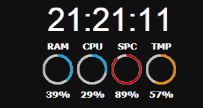

# Widget-Clock

Clock digital for Windows 10/11

---
Is configurable

---
Configs:

|Combination|Result|
|-----------|------|
|[True, True]| 24 hours with seconds|
|[True, False]| 24 hours no seconds|
|[False, True]| 12 hours with seconds|
|[False, False]| 12 hours no seconds|

## Install
execute widget-clock-setup.exe

> with Python 3.12
